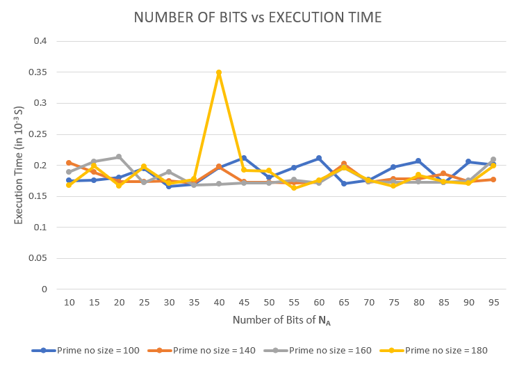
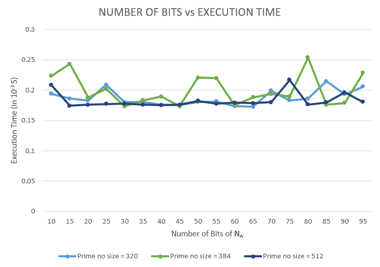

# Secure Key Exchange Using Enhanced Diffie-Hellman Protocol Based on String Comparison

In this project we have implemented the secure key exchange algorithm dicussed in [this paper](./dh.pdf). This paper claims to have a better security and better computation speeds.

## Implementation details

### Language and framework
The paper had originally been implemented in <b>C</b> and we have implemented it in <b>Python 3.6</b>. We use VS code as our IDE and we have used Python's own 
<b>CryptoLib</b> library for generation of random numbers and large prime numbers. 

### Implementation methodology, methods and optimisations used
The paper requires us to generate large "safe" prime numbers, which we have achieved by using the CryptoLib library. For the <b>Commitment</b> scheme required for key exchange,
we have implemented the <b>Pederson's Commitment</b> scheme. We have chosen the random generator "g" to be 2 in all of our experiments since we use "safe" prime number and since its 
sufficient to show the working of Diffe-Helman for g=2 when safe prime are used. 

The paper requires us to perform <b>mod</b> and <b>power</b> operations among extremely large numbers (sometimes each number is 512 bits big). To achieve fast computation of
such calculations, we have used certain optimisations such as <b>(a * b)mod c = ((a mod c) * (b mod c)) mod c</b>, <b>a^b mob p = a^(b mod p) mob p</b> which can be obtained from fermat's
little theorem, and we have also used Ptyhon's "pow" function for certain calculations.

The paper also requires us to <b>XOR two strings</b>. To achive this, we convert the two given strings to a number of <b>base 36</b>, and XOR these two obtianed numbers.
This would give the exact same result as XORing two strings character by character.

For the simulation of communication between two parties, we have implemented a <b>Client-Server socket programming</b> architecture,
where the key exchange is initiated by the client.

## Experimentation and Results

We have carried out the exact same experiments as the paper. We have run the experiments with different lengths of random strings and varying size of primes. The metric for 
evaluation is the execution time. The sizes of primes used are {100, 140, 160, 180, 320, 384, 512 bits} and different lengths og random string used are {k = 10, 15, 30, ..., 85, 90, 95 bits}.

### Results

The following two graphs show the plots of length of random strings (k = 10 ,15,30,...,80 bits) versus execution time of the protocol for varying size of primes 
(100,140,...,512 bits).

#### <b>Graph 1: Length of prime = {100, 140, 160, 180 bits}</b>

#### <b>Graph 2: Length of prime = {320, 384, 512 bits}</b>

### Improvements compared to the paper

Our implementation of the algorithm runs faster than the implementation of the paper. Our implementation has an average speedup of <b>17.7 times</b> for lengths of primes = {100, 140, 160, 180 bits}
and an average speedup of <b>428 times</b> for length of primes = {320, 384, 512 bits}.

Hence our implementation achieves a total average speedup of <b>194 times</b>. Since we have implemented in Python, we expect our implementation to be atleast <b>5 times</b> more 
faster when implemented in C (like they have done in the paper), since computations in C are atleast 5 times faster than in Python.

